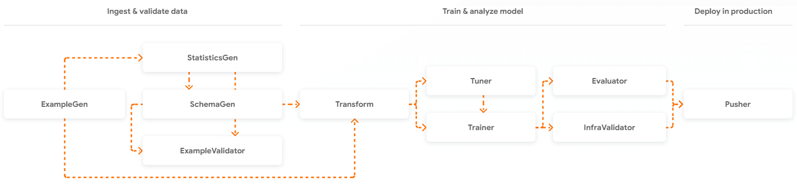

# Model: TensorFlow Decision Forest

Result benchmarking baseline models (with synthetic dataset):  
| Model Name | Accuracy | Val Accuracy | AUC | Val AUC | Val F1 Score Micro | Val F1 Score Macro | Best Threshold |
|---|---|---|---|---|---|---|---|
| random_forest_model | 0.918452 | 0.720833 | 0.977332 | 0.786530 | 0.729167 | 0.728105 | 0.55 |
| gradient_boosted_trees_model | 0.768452 | 0.741667 | 0.870572 | 0.792852 | 0.743056 | 0.743043 | 0.48 |
| cart_model | 0.772024 | 0.722222 | 0.816233 | 0.758957 | 0.740278 | 0.740217 | 0.61 |

# TFX Pipelines

A TFX pipeline is a sequence of components that implement an ML pipeline which is specifically designed for scalable, high-performance machine learning tasks. Components are built using TFX libraries which can also be used individually. (Source: https://www.tensorflow.org/tfx)

# Future works

- Implement pipelines with apache beam or apache airflow
- Implement monitoring with prometheus + grafana
- Deploy with Vertex Ai Pipelines
- Improve batch inference (currently using tfserving via http protocol, high latency)

# Acknowledgements

- [AIC Compfest 2023](https://compfest.id/) - for providing GCP credit support.

# References

- [TensorFlow Extended (TFX) Tutorials](https://www.tensorflow.org/tfx/tutorials)
- [TFX Guide & Docs](https://www.tensorflow.org/tfx/guide)
- [TFX Examples (GitHub)](https://github.com/tensorflow/tfx/tree/master/tfx/examples)
- [Oreily Ebook MLOps TFX](https://www.oreilly.com/library/view/building-machine-learning/9781492053187/)
- [Dicoding MLOps Course](https://www.dicoding.com/academies/443)
